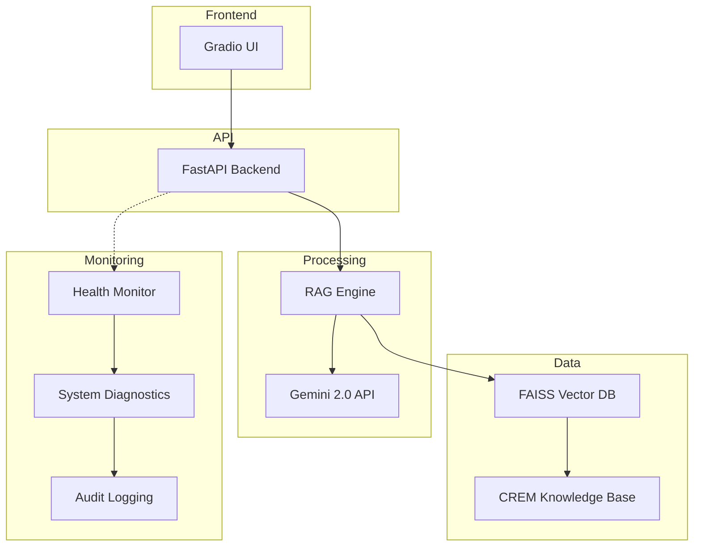
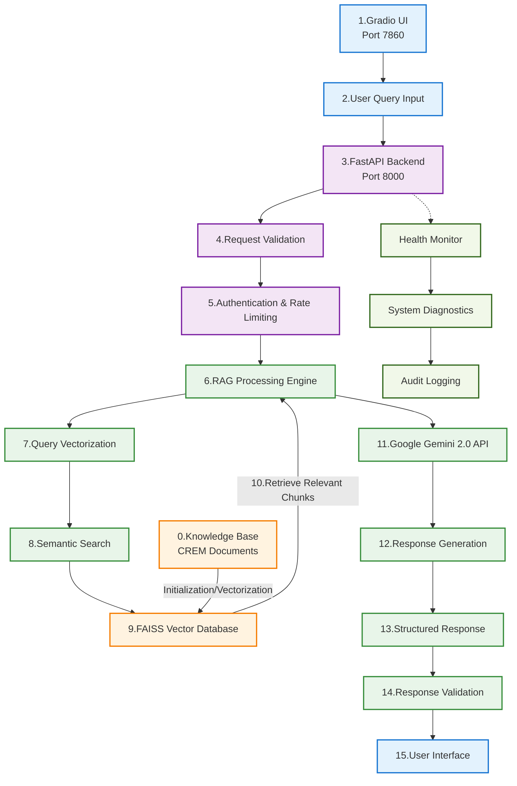

# Trend Micro Internal Knowledge Q&A Robot
- aka Trend Micro RAG Walking Dictionary
- aka 趨勢RAG活字典 


## Demo & Screenshots

### Quick Start Demo


### Gradio Interface Demo


### Chatbot Interface


### API Documentation


## Problem & Solution

**Daily Struggle**: Every time I need to answer questions about a new Trend Vision One App, I spend hours digging through hundreds of PDFs and wiki pages. With 100+ apps and growing, it's exhausting to learn each new app while trying to find accurate, up-to-date information. Even as a senior analyst, I often end up with outdated answers or missing critical details. This bottleneck prevents me from quickly providing stakeholders with the data insights they need, ultimately dragging down company productivity.

**My Solution**: Built this RAG-powered knowledge assistant that instantly finds relevant information and provides accurate answers with source references. This eliminates manual document hunting and enables immediate access to current information, significantly boosting both individual and organizational productivity.


## Deployment Options

### One-Click Deployment (Recommended)
```bash
# Execute automated deployment script
presentation/scripts/start_simple.bat
```

### Manual Deployment
```bash
# Environment setup
python -m venv aiops
aiops\Scripts\activate.bat
pip install -r core_app\requirements.txt

# API server startup
python core_app/app.py

# Frontend interface
python core_app/gradio_app.py
```

### Containerized Deployment
```bash
# Docker Compose deployment
cd containerization
docker-compose up -d
```

## API Endpoints

| Endpoint | Method | Description | Authentication |
|----------|--------|-------------|----------------|
| `/health` | GET | System health status | None |
| `/docs` | GET | Interactive API documentation | None |
| `/info` | GET | System information and configuration | None |
| `/examples` | GET | Sample query examples | None |
| `/ask` | POST | Query processing endpoint | API Key |


### Technology Stack

- **Runtime Environment**: Python 3.13.5
- **Web Framework**: FastAPI with Uvicorn ASGI server
- **AI/ML Libraries**: LangChain, FAISS, Sentence Transformers
- **Cloud AI Service**: Google Gemini 2.0 API
- **Frontend Framework**: Gradio
- **Containerization**: Docker with Docker Compose
- **System Monitoring**: psutil for resource utilization tracking
- **Data Extracting**: pdfplumber for PDF 

## System Architecture



## Data Flow



**Color Legend:**
- <span style="background-color:#e3f2fd; border:1px solid #1976d2; padding:2px 8px;">Frontend</span>
- <span style="background-color:#f3e5f5; border:1px solid #7b1fa2; padding:2px 8px;">API Layer</span>
- <span style="background-color:#e8f5e9; border:1px solid #388e3c; padding:2px 8px;">Processing/LLM Layer</span>
- <span style="background-color:#fff3e0; border:1px solid #f57c00; padding:2px 8px;">Data Layer</span>
- <span style="background-color:#f1f8e9; border:1px solid #33691e; padding:2px 8px;">Monitoring Layer</span>

## Engineering Practices

### RAG Pipeline Optimization
- **Text Chunking**: 512-character chunks with 50-character overlap for optimal context retention
- **Prompt Engineering**: Custom CREM_PROMPT_TEMPLATE with temperature 0.05 to minimize hallucinations
- **Vector Search**: FAISS index with top-5 similarity matching and 0.7 score threshold
- **Quality Validation**: 100% quality score with 19 chunks averaging 410 characters

## Development Status

### In Development
- **Testing Framework**: pytest security tests execution and validation
    - Unit Tests: Individual component functionality
    - Integration Tests: End-to-end system validation
    - Performance Tests: Load testing and response time analysis
    - Security Tests: Vulnerability assessment and penetration testing
- **Security Implementation**: Security testing and vulnerability assessment
    - API Key Management
    - Input Validation
    - Data Protection
    - Container Security


## Future Enhancements

### RAG System Evaluation Metrics
- **Response Accuracy**: Implement automated testing with predefined Q&A pairs to measure answer correctness
- **Relevance Scoring**: Use cosine similarity between query and retrieved context to ensure relevance
- **Hallucination Detection**: Compare generated responses against source documents using semantic similarity

### Testing Framework Enhancement
- **Automated RAG Testing**: Create test suite with 50+ predefined Q&A pairs covering different CREM topics

### CI/CD Pipeline Implementation
- **Automated Testing**: GitHub Actions workflow that runs tests on every commit

## Support and Contact

For technical support or questions regarding this implementation, please refer to the project documentation or contact the development team.

---

**Note**: This system is designed for demonstration and educational purposes. For production deployment, additional security hardening and compliance measures should be implemented. 