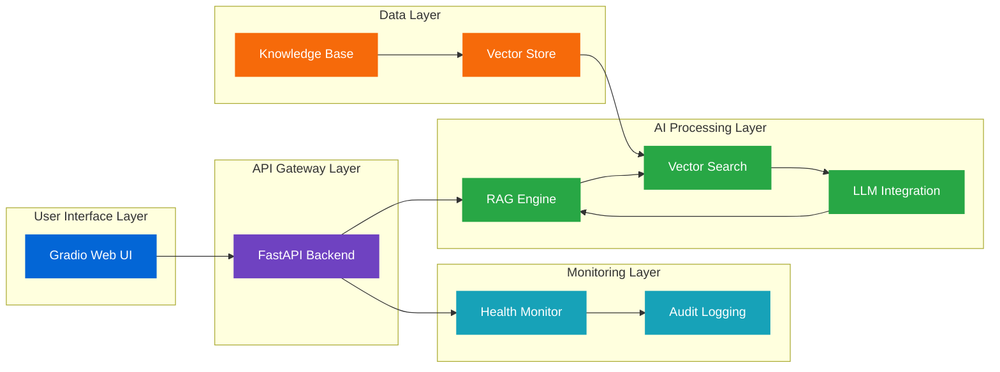

# Trend Micro Technical Knowledge Q&A Assistant
Transform hours of document hunting into seconds of intelligent answers with our RAG-powered knowledge assistant. Supports company technical documentation, research reports, network error codes, log formats, and product knowledge (starting from DDI).

## Problem & Solution

**Daily Struggle**: Every time I need to answer questions about a new Trend Vision One App, I spend hours digging through hundreds of PDFs and wiki pages. With 100+ apps and growing, it's exhausting to learn each new app while trying to find accurate, up-to-date information. Even as a senior analyst, I often end up with outdated answers or missing critical details. This bottleneck prevents me from quickly providing stakeholders with the data insights they need, ultimately dragging down company productivity.

**My Solution**: Built this RAG-powered knowledge assistant that instantly finds relevant information and provides accurate answers with source references. This eliminates manual document hunting and enables immediate access to current information, significantly boosting both individual and organizational productivity.


## Demo & Screenshots

### Technical Query Examples

The chatbot can now answer questions about DDI syslog, Suricata rules, and network error codes. Below are example queries that demonstrate the system's capabilities:

*Screenshot: `docs/chatbot.gif`*


## Technology Stack

- **Runtime Environment**: Python 3.11+
- **Web Framework**: FastAPI with Uvicorn ASGI server
- **AI/ML Libraries**: LangChain, FAISS, Sentence Transformers
- **Cloud AI Service**: Gemini 2.5 Flash (gemini-2.5-flash)
- **Frontend Framework**: Gradio
- **Containerization**: Docker with Docker Compose
- **System Monitoring**: psutil for resource utilization tracking
- **Document & Table Processing**: pdfplumber, camelot-py, PyMuPDF, tabula-py for comprehensive PDF text and table extraction with multi-strategy approach

## System Architecture & Design

### High-Level Architecture Overview

```mermaid
graph LR
    subgraph "User Interface Layer"
        A[Gradio Web UI]
    end
    
    subgraph "API Gateway Layer"
        B[FastAPI Backend]
    end
    
    subgraph "AI Processing Layer"
        C[RAG Engine]
        D[Vector Search]
        E[LLM Integration]
    end
    
    subgraph "Data Layer"
        F[Knowledge Base]
        G[Vector Store]
    end
    
    subgraph "Monitoring Layer"
        H[Health Monitor]
        I[Audit Logging]
    end
    
    A --> B
    B --> C
    C --> D
    D --> E
    E --> C
    F --> G
    G --> D
    B --> H
    H --> I
    
    %% GitHub-friendly color scheme - works on both light and dark themes
    style A fill:#0366d6,stroke:#0366d6,stroke-width:2px,color:#ffffff
    style B fill:#6f42c1,stroke:#6f42c1,stroke-width:2px,color:#ffffff
    style C fill:#28a745,stroke:#28a745,stroke-width:2px,color:#ffffff
    style D fill:#28a745,stroke:#28a745,stroke-width:2px,color:#ffffff
    style E fill:#28a745,stroke:#28a745,stroke-width:2px,color:#ffffff
    style F fill:#f66a0a,stroke:#f66a0a,stroke-width:2px,color:#ffffff
    style G fill:#f66a0a,stroke:#f66a0a,stroke-width:2px,color:#ffffff
    style H fill:#17a2b8,stroke:#17a2b8,stroke-width:2px,color:#ffffff
    style I fill:#17a2b8,stroke:#17a2b8,stroke-width:2px,color:#ffffff
```

### Core Design Principles

#### 1. **Modular Architecture**
- **Separation of Concerns**: Each layer has distinct responsibilities
- **Scalability**: Independent scaling of UI, API, and processing components
- **Maintainability**: Clear interfaces between components

#### 2. **RAG-Powered Intelligence**
- **Retrieval-Augmented Generation**: Combines document search with AI generation
- **Real-time Knowledge Access**: Instant access to up-to-date information
- **Source Attribution**: Every answer includes reference to source documents

#### 3. **Enterprise-Grade Features**
- **Multi-format Document Support**: PDF, tables, and structured data
- **Vector-based Search**: Semantic similarity for context-aware retrieval
- **Performance Optimization**: Sub-second response times for user queries

### Business Value & Impact

#### **Productivity Enhancement**
- **Time Savings**: Reduce document hunting from hours to seconds
- **Accuracy Improvement**: Eliminate outdated information risks
- **Knowledge Democratization**: Make expert knowledge accessible to all team members

#### **Operational Efficiency**
- **Reduced Training Time**: New team members can quickly access product knowledge
- **Consistent Responses**: Standardized answers across the organization
- **Scalable Support**: Handle multiple concurrent users without degradation

For detailed technical implementation and data flow specifications, please refer to our [Data Flow Documentation](docs/data_flow.md).

### API Endpoints & Integration
| Endpoint | Method | Description | Authentication |
|----------|--------|-------------|----------------|
| `/health` | GET | System health status | None |
| `/docs` | GET | Interactive API documentation | None |
| `/info` | GET | System information and configuration | None |
| `/examples` | GET | Sample query examples | None |
| `/ask` | POST | Query processing endpoint | **No Auth (Demo)** |

### Web Interface Access
- **Gradio Web UI**: `http://localhost:7860` or `http://127.0.0.1:7860`
  - ⚠️ **Important**: Do NOT use `http://0.0.0.0:7860` (browsers cannot access `0.0.0.0`)
  - The Gradio interface requires the API service to be running on `http://localhost:8000`
- **API Documentation (Swagger UI)**: `http://localhost:8000/docs`
- **API Health Check**: `http://localhost:8000/health`

**Security Notice**:
- `/ask` endpoint currently has **no authentication**
- This is a demo/development version, not production-ready
- Authentication must be implemented before production deployment

### Engineering Practices & Optimization

#### RAG Pipeline Optimization
- **Text Chunking**: 512-character chunks with 50-character overlap for optimal context retention
- **Prompt Engineering**: Custom PROMPT_TEMPLATE with temperature 0.05 to minimize hallucinations
- **Vector Search**: FAISS index with top-5 similarity matching and 0.7 score threshold
- **Data Processing**: 174 text chunks + 88 table extracts = 262 total vectors with 99,826 characters of structured table content and comprehensive enterprise document coverage

## Quick Start Guide

### Step 1: Clone the Repository

```bash
git clone https://github.com/your-username/aiops.git
cd aiops
```

### Step 2: Setup Python Virtual Environment (Required Step 3, 4, 5)

```bash
# Create virtual environment
python -m venv aiops

# Activate virtual environment
# Windows:
call aiops\Scripts\activate.bat
# macOS/Linux:
source aiops/bin/activate

# Install dependencies
pip install -r core_app/requirements.txt
```

### Step 3: Initialize RAG System (Build Vector Database)

**use Python directly (with virtual environment activated):**
```bash
# Windows 
python scripts/init_rag.py

# Linux/Mac
python scripts/init_rag.py
```

**Note**: After this step completes, the vector database files (`index.faiss` and `index.pkl`) will be created. The API will **automatically load** this database when it starts (see Step 5 below).

### Step 4: Configure Environment

```bash
# Copy environment template
cp config/env.example .env
# Edit .env file to add your Google API Key: GOOGLE_API_KEY=your_actual_api_key_here
```

### Step 5: Start Services

**Using Docker:**
```bash
cd containerization
docker-compose up -d
```

**Local Startup:**
```bash
# Start API server
python -m core_app.app

# Start Gradio interface (in separate terminal)
python -m core_app.gradio_app
# After Gradio starts, access the interface at:
# http://localhost:7860 or http://127.0.0.1:7860
```

## Future Roadmap

### 1. Advanced Retrieval Strategy (Search Quality)
* **Hybrid Retrieval (BM25 + Vector)**: Implement a reciprocal-rank fusion pipeline to balance keyword matching (for specific error codes) with semantic search, addressing the limitations of pure vector search on technical jargon.
* **Re-ranking Layer**: Integrate a Cross-Encoder re-ranker (e.g., BGE-Reranker) to refine the top-k retrieved contexts before feeding them to the LLM.

### 2. Robust Data Pipeline (Data Engineering)
* **Enhanced Table Extraction**: Harden layout-aware parsing for complex Trend Micro manuals. Plan to benchmark `pdfplumber` vs `Unstructured.io` and build a regression test set specifically for error-code tables.
* **Incremental Indexing**: Move from full re-indexing to an event-driven pipeline (using Celery or Kafka) that processes only new/updated documents.

### 3. LLM Ops & Evaluation (MLOps)
* **Automated Evaluation (Ragas/TruLens)**: Integrate a framework to continuously score "Context Recall" and "Faithfulness" to prevent regression when updating the knowledge base.
* **Guardrails**: Implement output validation to ensure the model refuses to answer non-technical questions or sensitive internal data inquiries.

## Support and Contact

For technical support or questions regarding this implementation, please refer to the project documentation or contact the development team.

---

**Note**: This system is designed for demonstration and educational purposes. For production deployment, additional security hardening and compliance measures should be implemented. 