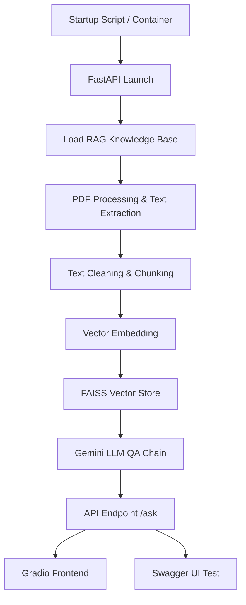

# Trend Micro Cybersecurity Report QA API

## Objective

Build a fast, verifiable local prototype to demonstrate core AI engineering and automated operations capabilities. The goal is to enable interviewers to launch the AI QA service and successfully call the API with a single command.

---

## Project Structure

```
AIOps/
├── core_app/                # Main AI service and knowledge base
│   ├── __init__.py          # Package initialization
│   ├── app.py              # FastAPI application
│   ├── main.py             # Core AI Q&A system
│   ├── gradio_app.py       # Gradio frontend interface
│   ├── requirements.txt    # Dependencies list
│   └── rag/                # RAG system core
│       ├── __init__.py         # RAG package initialization
│       ├── pdf_processor.py    # PDF processing module
│       ├── text_processor.py   # Text processing module
│       ├── crem_knowledge.py   # Knowledge base module
│       ├── data/               # Raw data and processed results
│       │   ├── sb-crem.pdf           # CREM technical document
│       │   ├── extracted_text.txt    # Extracted raw text
│       │   ├── cleaned_text.txt      # Cleaned text
│       │   ├── text_chunks.json     # Chunked text
│       │   ├── text_processing_report.json  # Processing report
│       │   └── validation_report.json       # Validation report
│       └── vector_store/           # Vector database
│           └── crem_faiss_index/   # FAISS vector index
│
├── start.bat                # Main startup script
├── setup_env.bat            # Environment setup script
│
├── tests/                   # Unified testing framework
│   ├── __init__.py          # Test package initialization
│   ├── README.md            # Test documentation
│   ├── pytest.ini          # pytest configuration
│   ├── unit/                # Unit tests
│   ├── integration/         # Integration tests
│   ├── performance/         # Performance tests
│   ├── security/            # Security tests
│   ├── utils/               # Test utilities
│   └── scripts/             # Test scripts
│
├── docs/                    # Project documentation
│   ├── README.md            # Project overview
│   └── Quick_Start.md       # Quick start guide
│
├── containerization/        # Docker settings
│   ├── Dockerfile           # Container configuration
│   ├── docker-compose.yml   # Docker Compose orchestration
│   └── .dockerignore        # Docker ignore file
│
├── config/                  # Environment variables and app config
│   ├── env.example          # Environment variables template
│   └── config.env           # Actual environment configuration
│
├── aiops/                   # Python virtual environment
├── .vscode/                 # VS Code settings
├── TESTS.md                 # Testing framework documentation
├── RAG_DEVELOPMENT_PLAN.md # RAG development plan
├── .gitignore              # Git ignore file
└── .git/                   # Git version control
```

---

## Flow



---

## Technology Stack

- **Python 3.13.5**
- **FastAPI**
- **Gradio**
- **LangChain**
- **FAISS**
- **HuggingFace Sentence Transformers**
- **Google Gemini API**
- **Docker / Docker Compose**
- **psutil / python-dotenv / pydantic**
- **Windows batch scripts / test scripts**

---

## Deployment

- **Docker Deployment**:
  - In the containerization/ directory, run `docker-compose up -d`
- **Local Startup**:
  - Run `start.bat` or `python core_app/app.py`
- **Gradio Frontend**:
  - Run `python core_app/gradio_app.py` to launch the local web interface
- **For detailed steps and troubleshooting**:
  - See [docs/Quick_Start.md](Quick_Start.md)

---

## AI Model Security Settings

- **API Key Security**:
  - Set `GOOGLE_API_KEY` in config.env or .env; key is masked in health checks.
- **Environment Variable Management**:
  - All sensitive settings (API key, model params) are managed via environment variables, not hardcoded.
- **Key Format Validation**:
  - On startup, the key format and length are validated; errors will halt the service.
- **Knowledgebase File Permissions**:
  - Mounted as read-only in containers to prevent leaks.
- **Security Logging**:
  - Startup and API requests are logged for security auditing.

---
