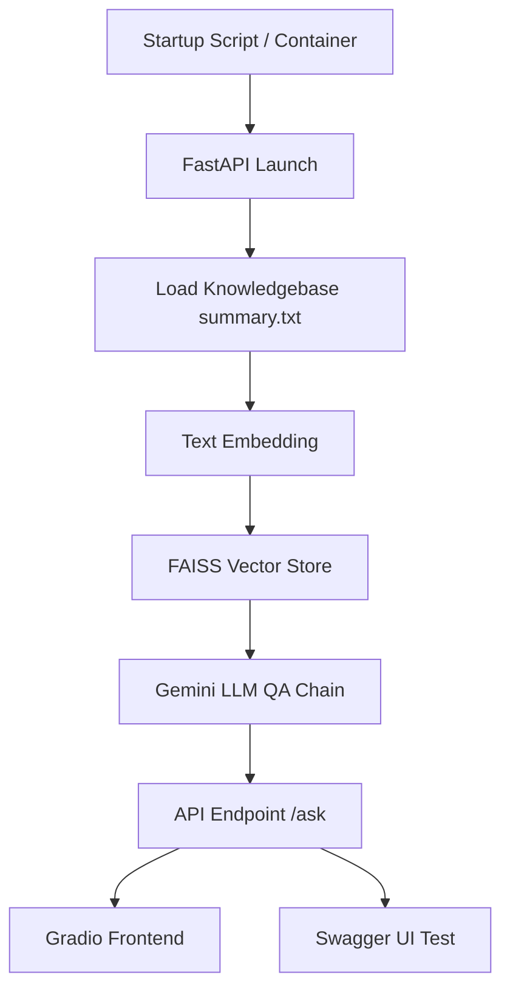

# Trend Micro Cybersecurity Report QA API

## Objective

Build a fast, verifiable local prototype to demonstrate core AI engineering and automated operations capabilities. The goal is to enable interviewers to launch the AI QA service and successfully call the API with a single command.

---

## Project Structure

```
AIOps/
├── core_app/                # Main AI service and knowledge base
│   ├── app.py
│   ├── main.py
│   ├── requirements.txt
│   ├── knowledgebase.txt
│   ├── summary.txt
│   └── gradio_app.py
│
├── start.bat                # Main startup script
├── setup_env.bat            # Environment setup script
├── start_api_enhanced.bat   # Enhanced startup script
│
├── testing_tools/           # Project validation and test scripts
│   ├── quick_test.bat
│   ├── validate_project.py
│   ├── validate_project.bat
│   └── test_security.py
│
├── docs/                    # Documentation
│   ├── README.md
│   ├── PROJECT_STATUS.md
│   ├── QUICK_START.md
│   └── docker.md
│
├── containerization/        # Docker settings
│   ├── Dockerfile
│   ├── docker-compose.yml
│   └── .dockerignore
│
├── config/                  # Environment variables and app config
│   ├── env.example
│   └── config.env
│
├── tests/                   # Automated test scripts
│   ├── test_comprehensive.py
│   ├── test_summary.py
│   └── test_gemini_only.py
│
├── python_config/           # Python config
├── examples/                # Example files
├── aiops/                   # Python virtual environment
├── .vscode/                 # VS Code settings
├── .gitignore
└── .git/
```

---

## Flow



---

## Technology Stack

- **Python 3.13.5**
- **FastAPI**
- **Gradio**
- **LangChain**
- **FAISS**
- **HuggingFace Sentence Transformers**
- **Google Gemini API**
- **Docker / Docker Compose**
- **psutil / python-dotenv / pydantic**
- **Windows batch scripts / test scripts**

---

## Deployment

- **Docker Deployment**:
  - In the containerization/ directory, run `docker-compose up -d`
- **Local Startup**:
  - Run `start.bat` or `python core_app/app.py`
- **Gradio Frontend**:
  - Run `python core_app/gradio_app.py` to launch the local web interface
- **For detailed steps and troubleshooting**:
  - See [docs/QUICK_START.md](QUICK_START.md) and [docs/docker.md](docker.md)

---

## AI Model Security Settings

- **API Key Security**:
  - Set `GOOGLE_API_KEY` in config.env or .env; key is masked in health checks.
- **Environment Variable Management**:
  - All sensitive settings (API key, model params) are managed via environment variables, not hardcoded.
- **Key Format Validation**:
  - On startup, the key format and length are validated; errors will halt the service.
- **Knowledgebase File Permissions**:
  - Mounted as read-only in containers to prevent leaks.
- **Security Logging**:
  - Startup and API requests are logged for security auditing.

---
