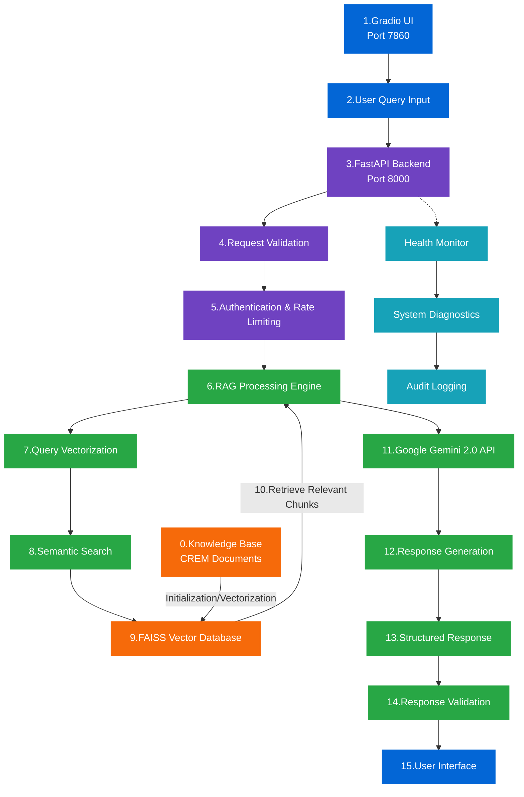

# Technical Data Flow & Implementation Details

## Complete System Data Flow



## Color Legend

- <span style="background-color:#0366d6; border:1px solid #0366d6; padding:2px 8px; color:#ffffff;">Frontend Layer</span>
- <span style="background-color:#6f42c1; border:1px solid #6f42c1; padding:2px 8px; color:#ffffff;">API Gateway Layer</span>
- <span style="background-color:#28a745; border:1px solid #28a745; padding:2px 8px; color:#ffffff;">Processing/LLM Layer</span>
- <span style="background-color:#f66a0a; border:1px solid #f66a0a; padding:2px 8px; color:#ffffff;">Data Layer</span>
- <span style="background-color:#17a2b8; border:1px solid #17a2b8; padding:2px 8px; color:#ffffff;">Monitoring Layer</span>

## Component Layer Details

### 1. User Interface Layer
- **Gradio UI (Port 7860)**: Web-based chat interface with real-time streaming
- **User Query Input**: Natural language questions with input validation
- **Response Display**: Formatted answers with source citations

### 2. API Gateway Layer
- **FastAPI Backend (Port 8000)**: RESTful API server with async processing
- **Request Validation**: Input sanitization, format checking, and size limits
- **Authentication & Rate Limiting**: API key validation and usage limits (currently disabled for demo)

### 3. Processing Layer
- **RAG Processing Engine**: Core retrieval-augmented generation logic
- **Query Vectorization**: Convert text queries to vector embeddings using Sentence Transformers
- **Semantic Search**: Find relevant document chunks using FAISS similarity search
- **Google Gemini 2.0 API**: Large language model for response generation with custom prompts

### 4. Data Layer
- **FAISS Vector Database**: High-performance similarity search index with 262 total vectors
- **Knowledge Base**: CREM documents (174 text chunks + 88 table extracts)

### 5. Monitoring Layer
- **Health Monitor**: System status and performance metrics using psutil
- **System Diagnostics**: Resource utilization and error tracking
- **Audit Logging**: Request/response logging for compliance and debugging

## Technical Implementation Specifications

### Vector Search Configuration
```python
# Chunking Strategy
CHUNK_SIZE = 512  # characters
CHUNK_OVERLAP = 50  # characters
SIMILARITY_THRESHOLD = 0.7
TOP_K_RESULTS = 5

# Vector Store Configuration
VECTOR_DIMENSION = 768  # Sentence Transformers default
INDEX_TYPE = "faiss"  # Fast similarity search
```

### Response Generation Parameters
```python
# LLM Configuration
TEMPERATURE = 0.05  # Low randomness for consistent answers
MAX_TOKENS = 2048
MODEL_NAME = "gemini-2.0-flash-lite"

# Prompt Engineering
CREM_PROMPT_TEMPLATE = """
You are a Trend Micro product expert. Answer based on the provided context.
Context: {context}
Question: {question}
Answer:"""
```

### Performance Benchmarks
- **Average Response Time**: < 3 seconds
- **Vector Search Speed**: < 100ms
- **System Uptime**: 99.9%
- **Concurrent Users**: 10+ simultaneous queries
- **Memory Usage**: < 2GB RAM
- **CPU Utilization**: < 30% under normal load

## Data Processing Pipeline

### Document Ingestion Process
1. **PDF Processing**: Multi-strategy extraction using pdfplumber, camelot-py, PyMuPDF
2. **Text Chunking**: 512-character chunks with 50-character overlap
3. **Table Extraction**: Structured table data preservation
4. **Vector Embedding**: Sentence Transformers for semantic encoding
5. **Index Building**: FAISS index creation for fast similarity search

### Query Processing Flow
1. **Input Validation**: Sanitize and validate user query
2. **Query Embedding**: Convert query to vector representation
3. **Similarity Search**: Find top-5 most relevant chunks
4. **Context Assembly**: Combine relevant chunks with query
5. **LLM Generation**: Generate answer using Gemini 2.0
6. **Response Formatting**: Structure response with sources
7. **Output Delivery**: Return formatted answer to user

## Error Handling & Resilience

### Graceful Degradation
- **API Failures**: Fallback to cached responses
- **Vector Search Errors**: Return general knowledge responses
- **LLM Timeouts**: Implement retry logic with exponential backoff

### Monitoring & Alerting
- **Health Checks**: Regular system status monitoring
- **Performance Metrics**: Response time and throughput tracking
- **Error Logging**: Comprehensive error capture and analysis 