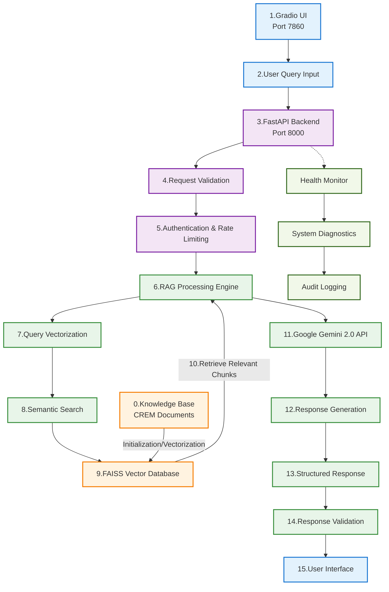

# Detailed Data Flow Diagram

## Complete System Data Flow

## Color Legend

- Frontend
- API Layer
- Processing/LLM Layer
- Data Layer
- Monitoring Layer

## Detailed Flow Description

### 1. User Interface Layer
- **Gradio UI (Port 7860)**: Web-based chat interface
- **User Query Input**: Natural language questions about Trend Micro products

### 2. API Layer
- **FastAPI Backend (Port 8000)**: RESTful API server
- **Request Validation**: Input sanitization and format checking
- **Authentication & Rate Limiting**: API key validation and usage limits

### 3. Processing Layer
- **RAG Processing Engine**: Core retrieval-augmented generation logic
- **Query Vectorization**: Convert text queries to vector embeddings
- **Semantic Search**: Find relevant document chunks using similarity
- **Google Gemini 2.0 API**: Large language model for response generation

### 4. Data Layer
- **FAISS Vector Database**: High-performance similarity search index
- **Knowledge Base**: CREM documents and technical specifications

### 5. Monitoring Layer
- **Health Monitor**: System status and performance metrics
- **System Diagnostics**: Resource utilization and error tracking
- **Audit Logging**: Request/response logging for compliance

## Technical Specifications

### Vector Search Parameters
- **Chunk Size**: 512 characters with 50-character overlap
- **Similarity Threshold**: 0.7 minimum score
- **Top Results**: 5 most relevant chunks

### Response Generation
- **Temperature**: 0.05 (low randomness for consistent answers)
- **Max Tokens**: 2048
- **Prompt Template**: Custom CREM_PROMPT_TEMPLATE

### Performance Metrics
- **Average Response Time**: < 3 seconds
- **Vector Search Speed**: < 100ms
- **System Uptime**: 99.9% 