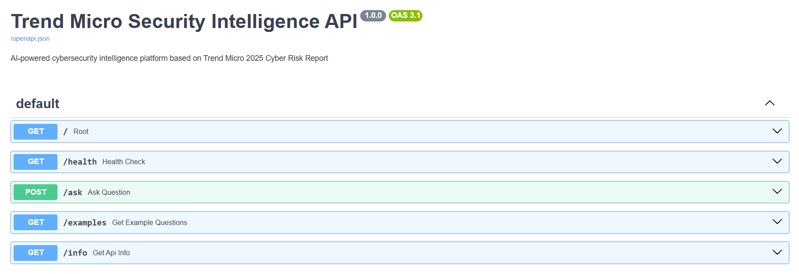
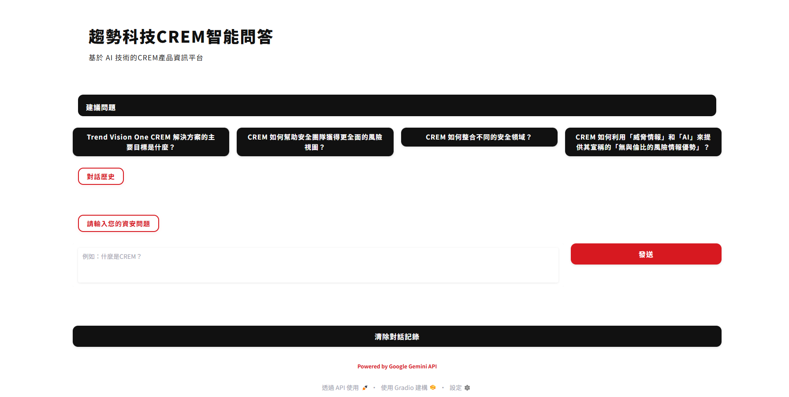
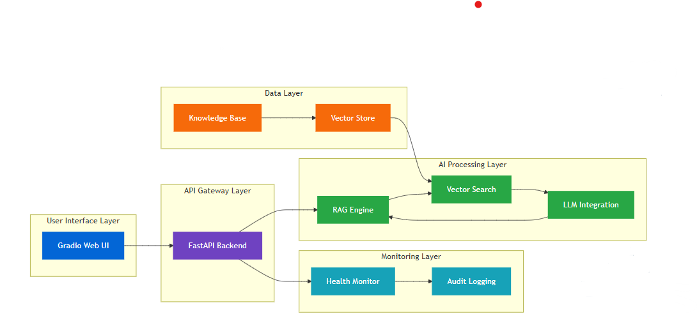

# 趨勢RAG活字典
## Trend Micro RAG Walking Dictionary

---
### 痛點 vs 解方
|  |  |
|:--:|:--:|
| 工人智慧 | 人工智慧 |

---
### 一鍵啟動腳本執行
**畫面**：
- 開啟終端機
- 執行 `cd presentation\scripts && start_simple.bat`
- 自動化流程展示

---

### API 服務啟動確認（30 秒）
- 開啟瀏覽器
- 訪問 `http://localhost:8000/docs`
- 展示 FastAPI 自動生成的文檔頁面

---

### Gradio 前端啟動（30 秒）
- 開啟新的終端機視窗
- 執行 `cd presentation\scripts && start_gradio.bat`
- 展示啟動過程

---

### Gradio 介面展示（30 秒）
- 開啟瀏覽器訪問 `http://localhost:7860`
- 展示聊天介面
- 展示建議問題按鈕

---

### 現場互動測試
- 切換到現場的 Gradio 介面 
- 測試預設問題和客製化問題
- 

> **測試 1 - 基礎問題**：
> 什麼是CREM？
> 什麼是CRI？

> **測試 2 - 客製化問題**：
> 輸入一個關於 CREM 技術細節的問題，展示系統的智能回答能力。

---
### 系統架構 (High-Level)
 

---
# 資料流程

|  |
|:--:|
|  |

|  |

---

### 技術亮點總結（30 秒）
#### 工程實踐
- **RAG 管道優化**：512 字元分塊，50 字元重疊
- **提示工程**：溫度 0.05，最小化幻覺
#### 技術棧
- **向量搜尋**：Top-5 相似度匹配，0.7 閾值
- **後端框架**：FastAPI + Uvicorn
- **AI 服務**：LangChain, Google Gemini 2.0 API
- **向量資料庫**：FAISS
- **前端介面**：Gradio
- **容器化**：Docker + Docker Compose

---

### Q&A

---

### 影片

[Windows一鍵安裝](https://youtu.be/lokCNrp3NSg)
[聊天機器人](https://youtu.be/7nk6L5uUotc)

---

# 🔍 系統監控

## 健康檢查端點
- `/health`：系統健康狀態
- `/info`：系統資訊和配置
- `/examples`：查詢範例

## 監控功能
- 資源利用率追蹤
- 系統診斷
- 審計日誌

---

# 🎯 核心優勢

## 效率提升
- **時間節省**：從數小時縮短到數秒
- **即時性**：即時存取最新資訊

## 使用者體驗
- **一鍵部署**：完全自動化流程
- **直觀介面**：Gradio 聊天介面
- **API 文檔**：FastAPI 自動生成

---

# 🚀 未來發展

## RAG 系統評估
- 回應正確率
- 相關性
## 測試框架
- 題目測試
## CI/CD 管道
- GitHub Actions 自動化測試
- 每次提交自動執行測試

